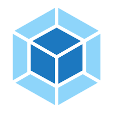

### Hi there 👋 I'm Josh a Full-Stack Developer!

<!-- **JBakesale/JBakesale** is a ✨ _special_ ✨ repository because its `README.md` (this file) appears on your GitHub profile.

Here are some ideas to get you started: -->

- 🔭 I’m currently working on [Urban Odyssey](https://github.com/JBakesale/Urban-Odyssey). A fitness & errand adventure application leveraging AI and Google Maps API to generate personalized, location based productivity missions! 
- 🌱 I’m currently always learning 
<!-- - 👯 I’m looking to collaborate on anything cutting-edge, AI -->
- 💬 Ask me about my IRL endurance adventures 
<!-- - 📫 How to reach me: ... -->
- 😄 Pronouns: he/him
- ⚡ Fun fact: I am a nature lover and animal rights advocate

## Tech Stack:

    <!-- JavaScript Icon -->
    
    <!-- jQuery Icon -->
    
    <!-- Cypress Icon -->
    
    <!-- Node.js Icon -->
    
    <!-- Ruby Icon -->
    
    <!-- Rails Icon -->
    
    <!-- RSpec Icon -->
    
    <!-- Webpack Icon -->
    
    <!-- React Icon -->
    
    <!-- HTML Icon -->
    
    <!-- CSS Icon -->
    
    <!-- PostgreSQL Icon -->
    
    <!-- Bootstrap Icon -->
    
    <!-- Jest Icon -->
    
    <!-- Mocha Icon -->
    
    <!-- Chai Icon -->
    

