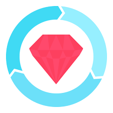

## Thanks for stopping by 👋
 # I'm Josh: Full-Stack Web Developer!

- 🔭 I’m currently working on [Urban Odyssey](https://github.com/JBakesale/Urban-Odyssey). A fitness & errand adventure application leveraging openAI and Google Maps API to generate personalized, location based productivity missions! 

- 🌱 I’m currently, ALWAYS learning 
<!-- - 👯 I’m looking to collaborate on anything cutting-edge, AI -->
- 💬 Ask me about my IRL endurance adventures 
<!-- - 📫 How to reach me: Discord: jbakesale -->
- 😄 Pronouns: he/him

- ⚡ Fun fact: I am a nature lover and animal rights advocate

## Tech Stack:

<!-- Languages -->
<h2>Languages:</h2>

    <!-- JavaScript Icon -->
    
    <!-- Ruby Icon -->
    
    <!-- HTML Icon -->
    
    <!-- CSS Icon -->
    

<!-- Frameworks -->
<h2>Frameworks:</h2>

     <!-- Ruby on Rails Icon -->
    
    <!-- React Icon -->
    
    <!-- jQuery Icon -->
    
    <!-- Bootstrap Icon -->
    

<!-- Database -->
<h2>Database:</h2>

    <!-- PostgreSQL Icon -->
    

<!-- Testing Framework -->
<h2>Testing Frameworks:</h2>

    <!-- Cypress Icon -->
    
    <!-- RSpec Icon -->
    
    <!-- Jest Icon -->
    
    <!-- Mocha Icon -->
    
    <!-- Chai Icon -->
    

<!-- Version Control -->
<h2>Version Control:</h2>

    <!-- Git Icon -->
    

